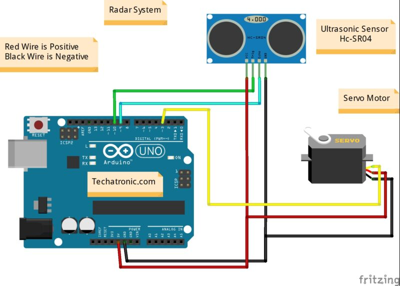

# Radar System with Ultrasonic Sensor and Arduino

## Overview

This project involves creating a radar system using an ultrasonic sensor, an Arduino, and Python. The Arduino is responsible for controlling the servo motor and collecting distance data using the ultrasonic sensor, while Python is used to visualize the data on a polar plot.

## Components Required

- Arduino board
- Ultrasonic sensor
- Servo motor
- Jumper wires
- Computer with Python installed
- (Optional) Breadboard for prototyping

## Wiring Connections

| Arduino UNO | Ultrasonic Sensor | Servo Motor |
|-------------|---------------------|-------------|
| (+5V) VCC   | VCC (Positive +)   | VCC (Red)   |
| GND         | GND (Ground -)      | GND (Black) |
| D10         | Trig Pin            | -           |
| D9          | Echo Pin            | -           |
| D3          | -                   | OUT (Orange)|

## Wiring Connection Diagram



## Arduino Setup

1. Connect the ultrasonic sensor to the Arduino:
   - Connect the sensor's `trigPin` to pin 10 on the Arduino.
   - Connect the sensor's `echoPin` to pin 9 on the Arduino.

2. Connect the servo motor to the Arduino:
   - Connect the servo's control pin to pin 3 on the Arduino.

3. Upload the provided Arduino code (`arduino_radar.ino`) to the Arduino board.

## Python Setup

1. Install required Python libraries:
   ```bash
   pip install pyserial matplotlib numpy
   ```

2. Copy the Python script (`radar_plot.py`) to your computer.

## Usage

1. Run the Python script (`radar_plot.py`):
   ```bash
   python radar_plot.py
   ```

2. The script will automatically detect the Arduino port, open a serial connection, and start plotting the radar data in real-time.

3. The servo motor will rotate from 15 to 165 degrees, and the corresponding distance measurements will be plotted on the polar plot.

4. The plot will continuously update as new data is received from the Arduino.

## Customization

- You can modify the Arduino code to adjust the servo motor's rotation range, delay, or any other parameters based on your requirements.

- The Python script can be customized for different plot styles, colors, or additional features.

## Troubleshooting

- Ensure that the Arduino is properly connected, and the COM port is accessible.

- Check that the Python script has the necessary permissions to access the serial port.

- Verify that the required Python libraries are installed.

## Notes

- This project provides a simple demonstration of creating a radar-like visualization using affordable components. Feel free to expand and enhance it based on your creativity and requirements.